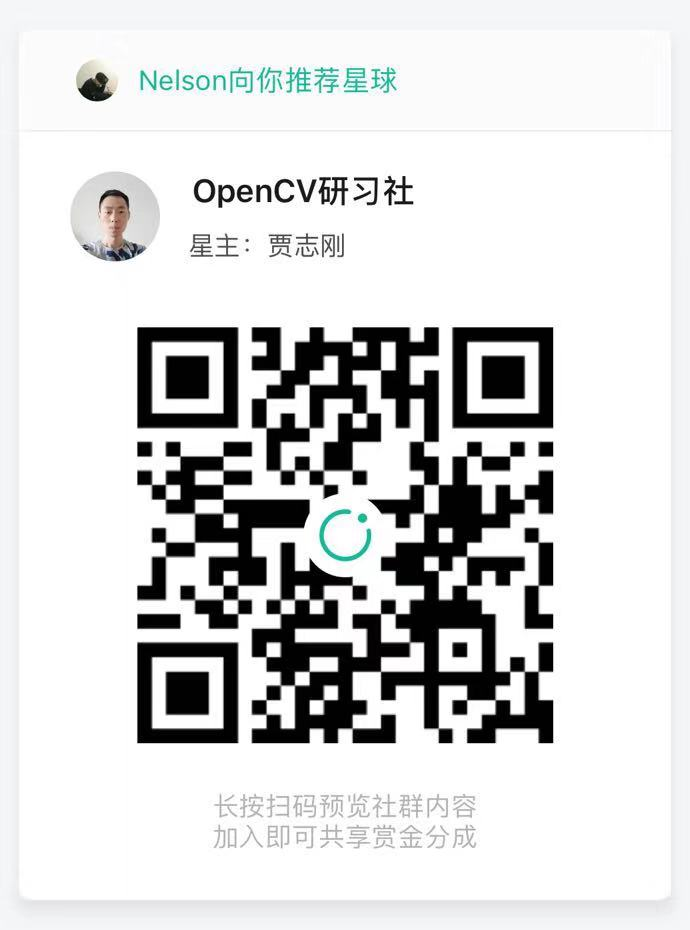

# Opencv学习笔记

> 学习笔记主要分为两大部分，第一部分是Opencv进行图像处理的基础知识，包括API的使用以及数字图像处理知识点的总结。第二部分是使用CUDA进行数字图像处理，这里主要包括CUDA编程基础以及Opencv中的CUDA的使用。s
>
> **声明：**
>
> Opencv部分是从知识星球“OpenCV研习社“，所做的学习笔记，在知识星球中该课程还有音频对每一个知识点进行讲解，是非常好的入门Opencv的资料，推荐二维码如下：
>
> CUDA编程是从Github项目中学习做的笔记，项目地址为：https://github.com/Ewenwan/ShiYanLou/tree/master/CUDA
>
> 

>     

# [Opencv C++ ]()

#### [图像基础操作]([https://github.com/RuyiLuo/Opencv/blob/master/C%2B%2B/%E5%9B%BE%E5%83%8F%E5%9F%BA%E7%A1%80%E6%93%8D%E4%BD%9C.md](https://github.com/RuyiLuo/Opencv/blob/master/C%2B%2B/图像基础操作.md))

- 图像的读取保存
- 赋值、复制克隆
- 图像像素的遍历
- 像素的像素运算
- 查找表LUT
- 像素的逻辑操作(位操作)
- 通道分离与合并
- 图像色彩空间的转换
- 图像像素值统计

#### [图像滤波](https://github.com/RuyiLuo/Opencv/blob/master/C%2B%2B/图像滤波.md)

- 图像卷积操作
- 图像噪声
- 图像去燥（常见的去燥方法）

## [CUDA](https://github.com/RuyiLuo/Opencv/blob/master/CUDA/CUDA.md)

- CUDA快速入门
- 查看GPU的配置情况
- CPU与GPU的数据交换